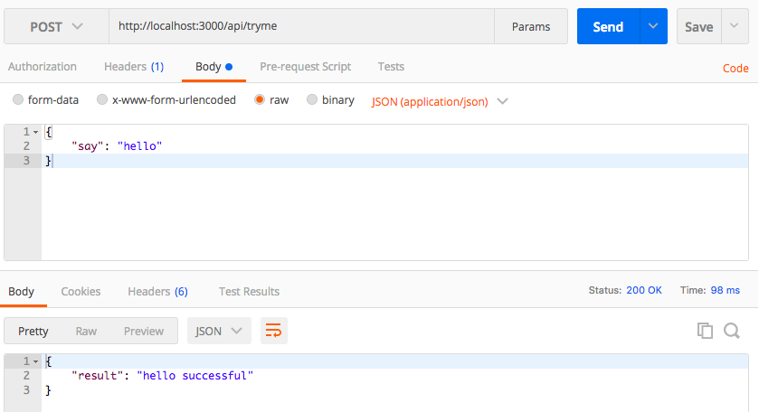

express-quiz
======================
![][david-url]
![][license-url]

这是一个小小测验，考察你对web应用、对express的理解，以及经验。下面：


## 开放题

谈谈你对[express.js](http://expressjs.com/)的理解，你觉得她是个什么鬼？

>灵活题目，follow your heart

你还知道其他哪些功能类似的产品？能否谈谈她们之间的差异？

>灵活题目，考察下你的工作经验，知识广度

[express.js](http://expressjs.com/)里有个概念叫`中间件`，做什么的？谈谈吧

>就看你是不是真的熟悉了

 ## 集合，准备开始操作

来吧，先把项目拉到本地再说：

```bash
#下载代码到本地
git clone https://github.com/leftstick/express-quiz.git

#进入测验代码目录
cd express-quiz

#安装项目依赖
npm install
```

### 第一题

来吧，从现有的项目代码，找到项目启动的命令，并且尝试运行一下看看

>送分题，不会的可以直接跪了

### 第二题

做一个页面吧，要求如下：

1. 访问路径是: `/view`
2. 页面需要使用一个叫[nunjucks](https://mozilla.github.io/nunjucks/)模版引擎编写
3. 页面里的内容随意，能显示就行

### 第三题

写一个`api`吧，要求如下：

1. 访问路径是：`/api/tryme`
2. 请求方法必须是：`POST`
3. 要能接受`request body`里的参数，格式是`{ "say": <随便什么值> }`； `Content-Type`必须是`application/json`
4. 返回值的格式是: `{ "result": "<随便什么值> successful" }`；状态码必须是`200`

如下图所示：




### 第四题

使用`Math.random() * 3`将第三题里的`api`做一个随机但小于`3s`的延迟返回

### 第五题

如何把把静态资源通过web的形式开放给开户端？譬如：`/public/img/`下的图片，如何让客户端使用`http://localhost:<port>/public/img/showtime.gif`的方式访问到？

### 第六题

现在修改项目，使之能以你自己的真实IP形式访问，而非`localhost`或者`127.0.0.1`

### 第七题

在服务器端记录所有请求的耗时，包括静态资源、`/view`页面，和`/api/tryme`

>如果你想给每个请求里分别加记录，那么恭喜你，肯定是跪了

## LICENSE ##

[MIT License](https://raw.githubusercontent.com/leftstick/express-quiz/master/LICENSE)


[david-url]: https://david-dm.org/leftstick/express-quiz.png
[license-url]: https://img.shields.io/github/license/leftstick/express-quiz.svg
